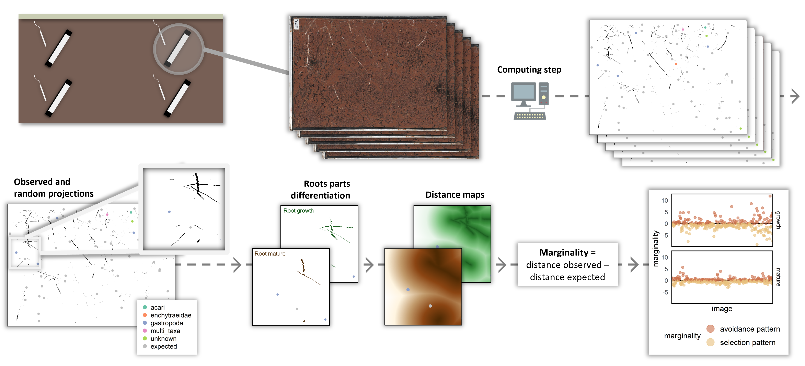

# Questioning the influence of roots: A soil fauna perspective on rhizosphere space

This repository contains the R scripts associated with the publication "*Questioning the influence of roots: A soil fauna perspective on rhizosphere space*" currently being written. This study uses high-resolution in situ imaging combined with resource selection function framework to quantify how soil invertebrates organise their activity around roots at the microscopic scale.

## Analytical approach

To answer the question about the fine scale root - fauna spatial relations, we developed an analytical approach that begins with image analysis using deep learning models. For roots analysis, we used a convolutional neural network-based software names RootPainter models (Smith et al. 2022). For invertebrate analysis, we developed a pipeline analysis based on a mathematical detection tool and a deep learning classification tool (Belaud et al., in prep; Hendrikx et al., in prep). We were thus able to generate binary images reflecting root structures and the fauna database, including their taxonomic range and location on the image. For roots, we distinct two functionnal parts - the growing part and the mature parts - by a substraction calcul. Thus, for each roots parts image masks, we generate distance maps (i.e., each pixels of the maps represent the minimum Euclidean distance to a root). We then projected the faunal occurrences on these distance maps to compute distances from each invertebrate to the nearest root. Distance to root was interpreted as habitat use under a Resource Selection Function (RSF) framework (Calenge et al. 2005). Habitat availability was quantified by projecting 50 random points per image onto root distance maps, yielding a null expectation of distances to the nearer root available within each image. Expected mean distances were computed from these random samples. For every image, we compared the observed invertebrate – root distances to this expectation to quantify marginality – a measure of departure from random spatial use of the root environment by inverterbrates. Marginality values wereas averaged per image to control for sampling heterogeneity, and computed independently for Acari, Collembola, Gastropoda, and for all taxa combined.

## Data

The data required to generate the results can be temporarily downloaded at the following link: [dataverse repository](https://entrepot.recherche.data.gouv.fr/dataset.xhtml?persistentId=doi:10.57745/9VMCNE).

## Code

The folder "scripts" contains 6 R-quarto files.

1.  [image_bank_selection](https://github.com/emmabelaud/rhizosphere/blob/df878ee7ec79c6107b54b8dd61caa8784b18dd74/scripts/1.%20image_bank_selection.qmd)

To balance temporal coverage and data quality, we selected a curated subset of the image dataset, consisting of noon and midnight captures across seven periods of 7-days sampling windows distributed through seasons and cropping phases. The attached r code details the steps that led to the selection of the final dataset.

2.  [root_parts_differentiation](https://github.com/emmabelaud/rhizosphere/blob/df878ee7ec79c6107b54b8dd61caa8784b18dd74/scripts/2.%20root_parts_differentiation.qmd)

Roots consist of functionally distinct regions: the growing apices, which exhibit intense exudation and high nutrient flow, and the older, mature parts, which are structurally and functionally more stable. To distinguish these two zones from the binary masks of the entire root system obtained during the image analysis step, we apply a temporal difference approach. Newly appearing root areas correspond to the growing regions, which can be identified by subtracting the binary mask at time 𝑡 − 𝑥 from the mask at time 𝑡. This requires defining the appropriate time interval 𝑥. To determine this interval, we analyzed temporal variations in root density and their derivatives using the attached R script.

3.  [root_habitat_maps_generation](https://github.com/emmabelaud/rhizosphere/blob/df878ee7ec79c6107b54b8dd61caa8784b18dd74/scripts/3.%20root_habitat_maps_generation.qmd)

The attached R script is designed to generate habitat maps. It applies the mask subtraction using the previously defined time interval and then computes, for both root regions, the maps of Euclidean distance to the nearest root. The script processes all binary images in a specified folder, generates root distance maps in raster format, and saves them as TIF files in an output folder.

4.  [distance_data](https://github.com/emmabelaud/rhizosphere/blob/df878ee7ec79c6107b54b8dd61caa8784b18dd74/scripts/4.%20distance_data.qmd)

Invertebrate occurrence data were spatially overlaid onto the root distance maps to calculate the distance of each invertebrate to the nearest root. Distance to root was interpreted as habitat use within a Resource Selection Function (RSF) framework (Calenge et al., 2005). Habitat availability was assessed by projecting 50 random points per image onto the root distance maps, providing a null expectation of distances to the nearest root within each image. Expected mean distances were then computed from these random samples. This script generates a CSV database containing, for each invertebrate occurrence, its distance to the nearest growing root part and to the nearest mature root part, along with the corresponding mean expected distances computed from the 50 random projections.

5.  [habitat_data_cleaning](https://github.com/emmabelaud/rhizosphere/blob/df878ee7ec79c6107b54b8dd61caa8784b18dd74/scripts/5.%20habitat_data_cleaning.qmd)

The adjacent script was used to generate a well-formatted database required for data analysis. It allows the database to be enriched with the necessary metadata, including microclimate sensor data (soil temperature and humidity recorded every 15 minutes) and the computation of their 24-hour amplitude values. It also incorporates data related to root resource availability, such as the overall root density in each image, quantified from the root pixel count in the binary images, and their temporal dynamics, calculated as the change in root pixel count between successive images taken 24 hours apart. Additionally, the database includes invertebrate density metrics, including total invertebrate abundance per image and predator abundance per image. The resulting database, named **"distance_data_cleaned"**, is ready for data analysis and is available in the output folder.

6.  [data_analysis](https://github.com/emmabelaud/rhizosphere/blob/df878ee7ec79c6107b54b8dd61caa8784b18dd74/scripts/6.%20data_analysis.qmd)

This script allows performing the analyses presented in the corresponding manuscript and automatically generates the associated graphics in the output folder.
