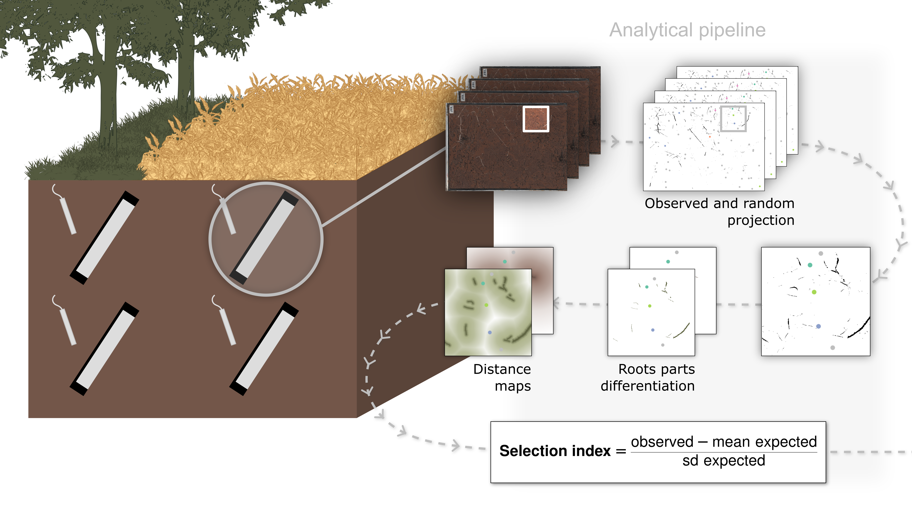

# A new dimension of the rhizosphere: Microscale spatial organization of soil invertebrates around roots

This repository contains the R scripts associated with the publication "*A new dimension of the rhizosphere: Microscale spatial organization of soil invertebrates around roots*" currently being written. Raw data are avaible at the following link : https://doi.org/10.57745/9VMCNE. This study uses high-resolution in situ imaging combined with resource selection function framework to quantify how soil invertebrates organise their activity around living roots at the microscopic scale.

## Analytical approach

To quantify habitat selection, we adapted techniques widely used in radio-tracking studies (Calenge et al. 2005) based on the notion of marginality (the deviation between available habitat conditions and those used by animals). We overlaid invertebrate occurrence data onto high-resolution root distance maps derived from the corresponding images, calculating the distance from each individual’s centroid detection to the nearest root. To characterize habitat availability for each invertebrate occurrence, we projected 50 random points onto the corresponding root distance map. We then derived the standardized effect size (Z-score) for marginality index by calculating the deviation of the observed distance from the mean null expected distance, scaled by the expected standard deviation. This index serves as a measure of spatial marginality, where negative values indicate organisms are closer to roots than expected by chance and positive values indicate they are farther than expected relative to a random distribution. We use the terms ‘selection’ and ‘avoidance’ in a strictly statistical sense to denote consistent negative or positive spatial deviations from the null expectation, respectively; these terms describe observed spatial patterns and do not imply intentional or fitness-driven behavioral choices.

## Data

The data required to generate the results can be temporarily downloaded at the following link: [dataverse repository]([https://doi.org/10.57745/9VMCNE]).

## Code

The folder "scripts" contains 6 R-quarto files.

1.  [S1_image_bank_selection](https://github.com/emmabelaud/rhizosphere/blob/main/scripts/1.%20S1_image_bank_selection.qmd)

To balance temporal coverage and data quality, we selected a curated subset of the image dataset, consisting of noon and midnight captures across seven periods of 7-days sampling windows distributed through seasons and cropping phases. The attached r code details the steps that led to the selection of the final dataset.

2.  [S2_root_parts_differentiation](https://github.com/emmabelaud/rhizosphere/blob/main/scripts/2.%20S2_root_parts_differentiation.qmd)

Roots consist of functionally distinct regions: the growing apices, which exhibit intense exudation and high nutrient flow, and the older, mature parts, which are structurally and functionally more stable. To distinguish these two zones from the binary masks of the entire root system obtained during the image analysis step, we apply a temporal difference approach. Newly appearing root areas correspond to the growing regions, which can be identified by subtracting the binary mask at time 𝑡 − 𝑥 from the mask at time 𝑡. This requires defining the appropriate time interval 𝑥. To determine this interval, we analyzed temporal variations in root density and their derivatives using the attached R script.

3.  [root_habitat_maps_generation](https://github.com/emmabelaud/rhizosphere/blob/main/scripts/3.%20root_habitat_maps_generation.qmd)

The attached R script is designed to generate habitat maps. It applies the mask subtraction using the previously defined time interval and then computes, for both root regions, the maps of Euclidean distance to the nearest root. The script processes all binary images in a specified folder, generates root distance maps in raster format, and saves them as TIF files in an output folder.

4.  [distance_data](https://github.com/emmabelaud/rhizosphere/blob/main/scripts/4.%20distance_data.qmd)

Invertebrate occurrence data were spatially overlaid onto the root distance maps to calculate the distance of each invertebrate to the nearest root. Distance to root was interpreted as habitat use within a Resource Selection Function (RSF) framework (Calenge et al., 2005). Habitat availability was assessed by projecting 50 random points per image onto the root distance maps, providing a null expectation of distances to the nearest root within each image. Expected mean distances were then computed from these random samples. This script generates a CSV database containing, for each invertebrate occurrence, its distance to the nearest growing root part and to the nearest mature root part, along with the corresponding mean expected distances computed from the 50 random projections.

5.  [habitat_data_cleaning](https://github.com/emmabelaud/rhizosphere/blob/main/scripts/5.%20habitat_data_cleaning.qmd)

The adjacent script was used to generate a well-formatted database required for data analysis. It allows the database to be enriched with the necessary metadata, including microclimate sensor data (soil temperature and humidity recorded every 15 minutes) and the computation of their 24-hour amplitude values. It also incorporates data related to root resource availability, such as the overall root density in each image, quantified from the root pixel count in the binary images, and their temporal dynamics, calculated as the change in root pixel count between successive images taken 24 hours apart. Additionally, the database includes invertebrate density metrics, including total invertebrate abundance per image and predator abundance per image. The resulting database, named **"distance_data_cleaned"**, is ready for data analysis and is available in the output folder.

6.  [S3_data_analysis](https://github.com/emmabelaud/rhizosphere/blob/main/scripts/6.%20S3_data_analysis.qmd)

This script allows performing the analyses presented in the corresponding manuscript and automatically generates the associated graphics in the output folder.
